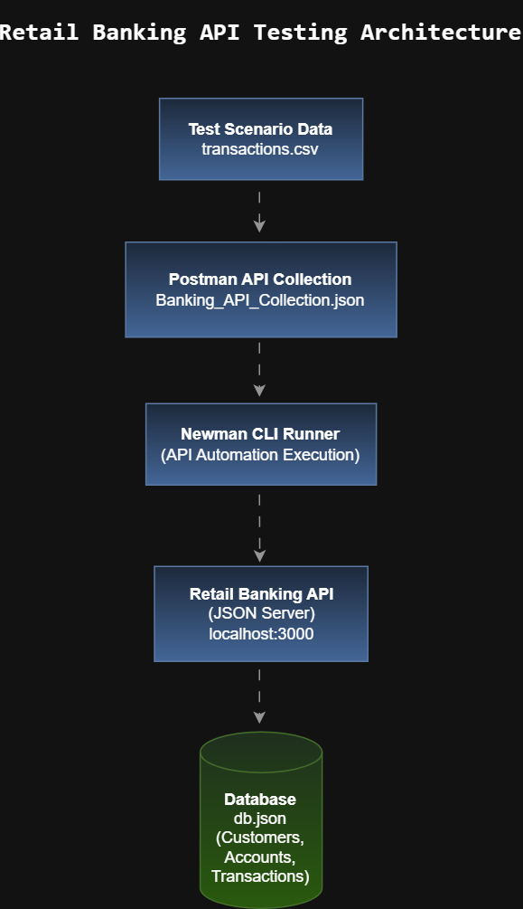

# Retail Banking API QA Simulation

A comprehensive API testing and QA automation project simulating a Retail Banking system.
This project demonstrates end-to-end API testing practices including functional validation, negative testing, compliance checks, automation execution, and defect analysis using Postman and Newman.

---

## Project Overview

The goal of this project is to simulate testing of a Retail Banking API system covering key banking operations such as:

* Customer creation
* Account management
* Funds transfer
* Compliance validation
* Fraud and risk scenarios

The project showcases how QA engineers design API test strategies, validate financial transactions, automate execution, and document defects.

---

## Project Objectives

* Design structured API test cases for banking workflows
* Validate transaction processing and business rules
* Perform negative and edge-case testing
* Simulate compliance and fraud detection scenarios
* Automate API execution using Newman
* Document defects and testing artifacts professionally

---

## System Architecture

<p align="center">
  
</p>

### Architecture Flow
```
Test Data (transactions.csv)
        ↓
Postman API Collection
        ↓
Newman CLI Automation
        ↓
Mock Banking API (JSON Server)
        ↓
Database (db.json)
```
---

## Technology Stack

| Tool        | Purpose                             |
| ----------- | ----------------------------------- |
| Postman     | API testing & collection management |
| Newman      | CLI automation runner               |
| JSON Server | Mock API server                     |
| Node.js     | Runtime environment                 |
| GitHub      | Version control                     |
| Draw.io     | Architecture diagram                |
| Markdown    | Documentation                       |

---

## Project Structure
```

Retail-Banking-API-QA-Simulation
│
├── banking_api_collection.json
├── banking_env.json
├── transactions.csv
├── db.json
│
├── test-documents
│   ├── Architecture_Diagram.png
│   ├── Test_Strategy.md
│   ├── Test_Scenario_Matrix.md
│   └── Defect_Log.md
│
├── README.md
└── .gitignore

```
---

## How to Run the Project

### Prerequisites

Install the following tools:

* Node.js
* Newman
* Postman (optional for manual testing)

---

### 1. Install Dependencies

npm install

---

### 2. Start the Mock Banking API

npm start

The API server will start at:

http://localhost:3000

---

### 3. Run API Automation Tests

newman run banking_api_collection.json -e banking_env.json -d transactions.csv

This command executes multiple API test scenarios including:

* Functional testing
* Negative validation
* Compliance scenarios
* Fraud detection simulations

---

## Test Coverage

The project covers several important banking test scenarios.

### Customer Management

* Create customer
* Duplicate customer validation
* Missing field validation

### Account Management

* Account creation
* Account status validation

### Transaction Processing

* Funds transfer
* Balance validation
* Daily transaction limit checks

### Negative Testing

* Invalid currency transfers
* Negative amount transactions
* Missing destination account

### Compliance Validation

* Frozen account transactions
* AML transaction spikes
* Rapid consecutive transfers

---

## Automation Execution

Automation is executed using **Newman CLI** with external test data.

Execution command:

newman run banking_api_collection.json -e banking_env.json -d transactions.csv

The automation simulates multiple transaction scenarios automatically using the dataset.

---

## Defect Analysis

During testing, several defects were identified and documented.

| Defect ID | Description                                 | Severity |
| --------- | ------------------------------------------- | -------- |
| DEF-01    | Duplicate transaction ID allowed            | High     |
| DEF-02    | Invalid currency accepted                   | Medium   |
| DEF-03    | Frozen account still processes transactions | Critical |
| DEF-04    | Negative transaction amount accepted        | High     |
| DEF-05    | Customer created without KYC validation     | High     |

Complete defect documentation can be found in:

test-documents/Defect_Log.md

---

## QA Artifacts

The project includes professional QA documentation.

| Document             | Description                    |
| -------------------- | ------------------------------ |
| Test Strategy        | Overall testing approach       |
| Test Scenario Matrix | Coverage of banking test cases |
| Defect Log           | Identified defects             |
| Architecture Diagram | API testing architecture       |

Location:

test-documents/

---

## Key Learning Outcomes

This project demonstrates practical QA engineering skills including:

* API testing using Postman
* Automation using Newman CLI
* Negative and edge-case validation
* Banking transaction rule validation
* Defect documentation and analysis
* Test strategy and scenario design
* Automation data-driven testing

---

## Future Enhancements

Possible improvements include:

* CI/CD integration with GitHub Actions
* Automated test reporting dashboards
* Performance testing with k6 or JMeter
* Security testing for authentication and authorization
* Integration with test management tools

---

## Author

Navya Kraleti

Quality Assurance Engineer

GitHub: https://github.com/NavyaKraleti
